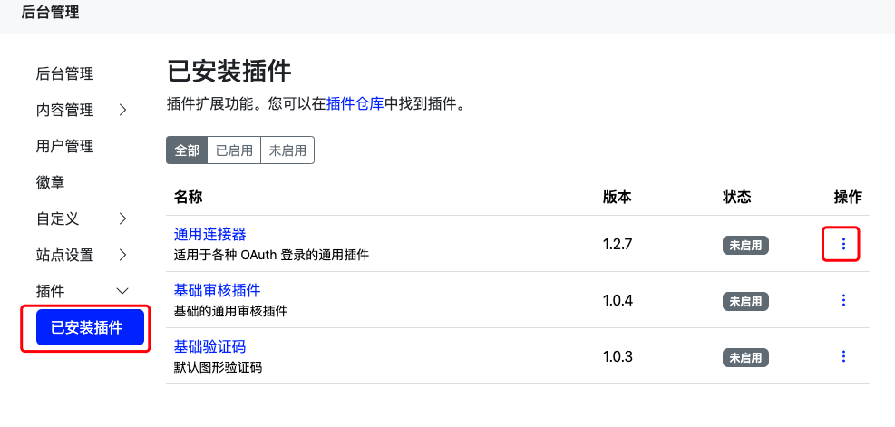
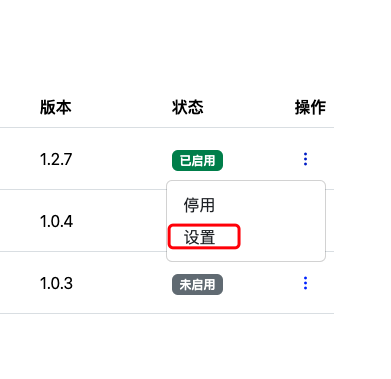
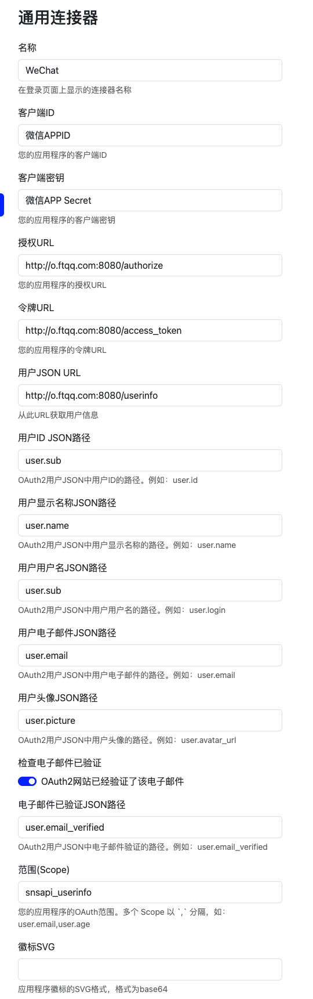
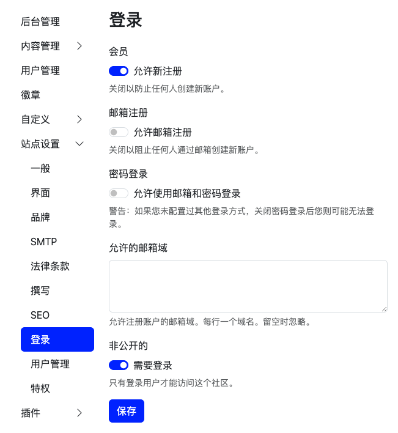
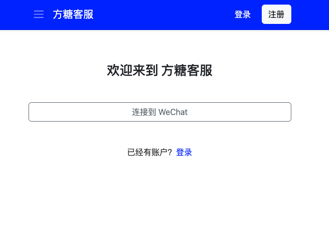

# WeAnswer

> 兔小巢官方的导出功能不支持导出回复，所以我也写了一个[支持回复的导出工具](https://github.com/easychen/txc-exporter)

腾讯兔小巢（txc.qq.com）收费了。一通比较以后，感觉Apache Answer是一个不错的开源替代。但是兔小巢两个很大的特点，一是用户可以直接通过微信登录。

- 好消息：Apache Answer支持 OAuth2 登录
- 坏消息：微信的 OAuth2 登录是他们魔改过的，不是标准流程。

于是便有了这个项目，它以代理的形式，把微信那奇形怪状的 OAuth2 流程改成标准流程。这样 Answer 和其他所有支持 OAuth2 标准流程的应用都可以通过微信来登录了。

## 如何使用

因为和回调相关，因此我们需要拥有备案以后的域名。

以下为测试方便

1. 假设 OAuth2代理 运行在 o.ftqq.com:8080
1. 假设 Answer 运行在 o.ftqq.com:9080

请根据自己的实际情况进行替换。

注意：只有公众号测试平台支持http和端口号，正式环境必须为https和80端口。

### 创建 .env 

复制 `.env.example` 为 `.env`，根据实际情况填写以下环境变量

```.env
WECHAT_APPID=微信公众号的APPID
WECHAT_APPSECRET=微信公众号的APP Secret
REDIRECT_URI=http://o.ftqq.com:8080/callback
SESSION_SECRET=随机密码
CLIENT_REDIRECT_URI=http://o.ftqq.com:9080/answer/api/v1/connector/redirect/basic
FAKE_EMAIL_DOMAIN=fake.mail.subdeer.com
```
### 启动OAuth代理

```bash
node index.js
```

如果需要稳定服务，可以使用 pm2 

```bash
npm install -g pm2
pm2 start index.js
```

### 配置通用连接器

进入 Answser的后台管理，选择 `已安装插件`，点击`操作`，启用。



启动后再次点击`操作`，



进入设置。

参考下图填写即可：



保存后，关闭`后台`→`站点设置`→`登录`中的邮箱注册和密码登录



登录页面和注册页面均可通过微信登录了。



## Next

兔小巢另一个特色，是可以通过微信通知用户，从而实现实时的反馈。这个就需要编写插件来实现了。Answer 采用 Go 实现，我不怎么会，欢迎PR。

- 可以参考官方的钉钉插件 <https://github.com/apache/incubator-answer-plugins/tree/main/notification-dingtalk>
